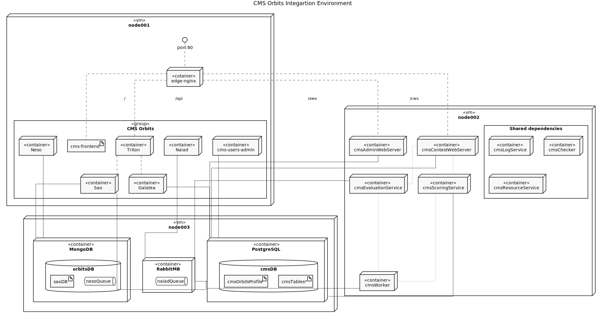

# CMS with Orbits VM's (orbtis-docker)

After you propmt `vagrant up` in the terminal (within this folder as working
directory), you should have 3 virtual machines with:

- [CMS](https://github.com/cms-dev/cms) ecosystem running as Docker contianers
- [Orbits](https://github.com/cms-orbits) ecosystem running as Docker containers
- All the storage services required by CMS and Orbits

All the services that expose an http endpoint that belongs to the aforementioned
stacks are reacheable through the "Edge Server" using the `192.168.7.11` ip
address. The routes in the edge server are the following:

- `/` Orbits Web Application
- `/api` Orbits API Gateway
- `/cws` CMS Contest Web Server
- `/aws` CMS Admin Web Server

The dataservices are exposed through `192.168.7.13` IP address using its default
ports, and goes as follows:

- `192.168.7.13:5672` PostgresSQL (with CMS schema and credentiasl populated)
- `192.168.7.13:27017` MongoDB (With Neso and Sao credentials initialized)
- `192.168.7.13:5672` RabbitMQ (With Admin credentials created)

The CMS database is ready to be used and comes with the `admin:admin`
credentials for administration tasks and `u1:p1`, `u2:p2` and `u3:p3` as test
users to hack around the CMS platform.

## Getting started

In order to spin up CMS+Orbits stack you only need to:

```shell
git clone https://github.com/cms-orbits/cms-boxes.git
cd cms-boxes/orbits-docker
vagrant up
```

And to stop all the virtual machines you can use `vagrant halt`.

## Topology

CMS and Orbits services, inclduing its dependencies and some development tools
are already provisioned as Docker container on the virtual machines, which are
managed systemd each one using a specific port. You can use the following
Deployment diagramn to determine where is running what you're looking for.



As shown in the image above, the services in the stack are distributed in the
following manner:

VM Name | IP Address | Domain Name | Purpose
---|:---:|:---:|---
node001 | 192.168.7.11 | lets-code.local | Contains all the Orbits microservices including the API Gateway, the Edge server and the Web Application UI.
node002 | 192.168.7.12 | - | Contains all the CMS services running as docker container and the CMS worker required compilers.
node002 | 192.168.7.13 | - | Contains all the CMS and Orbits datastorage dependencies

**Note:** In order reach the [lets-code.local](http://lets-code.local) domain
on your machine you'll need to install the
[vagrant-hostsupdater](https://github.com/cogitatio/vagrant-hostsupdater)
otherwise you will need to reach the edge server (vm node001) thourgh its IP
address (or manually add the domain to your machine's `/etc/hosts`)

Each machine can be accessed through ssh using the
`vagrant ssh` command followed its name. For example if you need to log into
node002 you have to prompt on your terminal:

```shell
vagrant ssh node002
```

This will log you as the `vagrant` user which capable of running command as root
user through `sudo`.

## Environment details

### CMS users

Upon virtual machine provisioning the administrative user creadentials
`admin:admin` will be created, which can be used to log into the *CMS Admin
WebServer* (using the <http://192.168.7.11/aws> URL) and manage the platform.
Alongside the administritive credentials three test users credentilas will
generated `u1:p1`, `u2:p2` and `u3:p3`. These test users are not assigned to any
contest but those are able to log into the
[con_test](http://192.168.7.11/cws/con_test) sample contest.

### CMS initial data and database configurations

The CMS database already comes with some initial data, as the default contest
called `con_test`, **all** the tasks defined in this repository
[cms-dev/con_test](https://github.com/cms-dev/con_test) and the users mentioned
above. Its administrative credentials and schema are `cmsuser:notsecure` and
`cmsdb` respectively.

### CMS services as Docker containers

As mentioned in the
[documentation](https://cms.readthedocs.io/en/latest/Introduction.html#services),
CMS is conformed by a set of python process which are running as Docker
containers and managed by docker-compose + systemd (except for the Ranking,
Proxy and Printing service which were disabled on purpose).

All the CMS containers are running on `node002` and only the Contest and Admin
webservers are reacheable through the edge server on `node001`. The port and
route distribution goes as follows:

CMS Service | RPC Port | HTTP Port | Edge server route
---|:---:|:---:|:---:
ContestWebServer | 21000 | 8888 | /cws
AdminWebServer | 21100 | 8889 | /aws
Checker | 22000 | - | -
EvaluationService | 25000 | - | -
Worker | 26000 | - | -
ResourceService |28000 | - | -
ScoringService | 28500 | - | -
LogService | 29000 | - | -
~~RankingService~~ _disabled_| - | 8890 | -
~~ProxyService~~ _disabled_ | 28600 | - | -
~~PrintingService~~ _disabled_ | 25123 | - | -

### Orbits users

Orbits as a whole does not require administrative users, and the test ones can
be only created once the `cmsusers` microservice is running.

### Orbits initial data and storage configurations

Orbits consumes 3 differnt data storages: PostgreSQL, MongoDB and RabbitMQ. For
each of them the root credentials `cmsuser:notsecure` are used. The required
initialization task are run on MongoDB and RabbitMQ containers once those are
started the firs time, so no further configuration should be required.

### Orbits services as Docker containers

Orbits Service | HTTP Port | Edge server route
---|:---:|:---
Triton (API Gateway) | 9000 | /api
users-admin | 8081 | /api/cmsusers
Galatea | 8082 | /api/galatea
Sao | 8083 | /api/sao
Naiad | 8084 | -
Neso | - | -

### Secret management

Orbtis relies on third party services to handle the user authentication and
authorization, which requires a client secret and other credentials. Due the
nature of these values those haven't been provided within the repository and
need to be manually writen in the cmsusers environment variables list.

This will be change in the upcoming iteration where all configuration values
should be managed on a centralized manner.

### OS users

The virtual machines come with several users, but the ones that could be handy
are:

User | UID | GUID | Home
---|---|---|---
vagrant | 1000 | 1000 | /home/vagrant
ubuntu | 1001 | 1001 | /home/ubuntu

### Container lifecycle management using docker-compose and systemd

Since this stack is not using any formal container orchestration, each container
is managed by docker-compose through a systemd service (kind of overkill but
works). All the services are using the same `compose@.service` template and the
distribution goes as follows:

- node001
  - compose@nginx (edge server)
  - compose@triton
  - compose@users
  - compose@galatea
  - compose@sao
  - compose@naiad
  - compose@neso
- node002
  - compose@cmsAdminWebServer
  - compose@cmsLogService
  - compose@cmsChecker
  - compose@cmsContestWebServer
  - compose@cmsEvaluationService
  - compose@cmsScoringService
  - compose@cmsResourceService
  - compose@cmsWorker
- node003
  - compose@postgresql
  - compose@mongodb
  - compose@rabbitmq

### CMS extra packages

In order to make the CMS Worker Docker image slim, its container relies on
mounting the required compilers from the host. Because of this, the following
extra packages are installed on `node002`:

- openjdk-8-jre, openjdk-8-jdk, gcj-jdk
- php7.2-cli, php7.2-fpm fpc
- haskell-platform, rustc, mono-mcs

## Considerations

Running each CMS process independlty as Docker container has not been testes or
backed by the CMS maintainers, and all the work withing this repository should
be considered as experimental. Either way feel free to play with it and submit
any contribution if you please. Happy hacking :octocat:.
