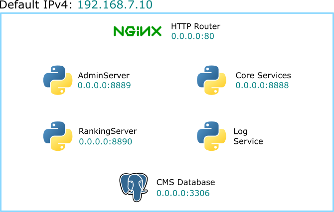

# All-in-one VM (Bulky)

**tl;dr** After you propmt `vagrant up` in the terminal (within this folder as
working directory), you should have a single virtual machine with [CMS](https://github.com/cms-dev/cms)
and its dependencies up and running, reachable through the IPv4 address
`192.168.7.10`. You will also be able to use the `admin:admin` administrator
credentials alongside the `u1:p1`, `u2:p2` and `u3:p3` test users ones to hack
around the platform.

## Getting started

In order to spin up a all-in-one CMS box you only need to:

```shell
git clone https://github.com/jossemarGT/cms-boxes.git
cd cms-boxes/ubuntu1604/bulky
vagrant up
```

And to stop you can use `vagrant halt`.

## Topology

CMS services, its dependencies and some development tools are running inside
the all-in-one virtual machine as systemd services each one using a specific
port.



## CMS

### Users

The Vagrant provisioning will generate an administrative user with username
and password `admin`, which can be used to log into the *CMS Admin Web Server*
(using the <http://192.168.7.10/aws> URL) and manage the platform.

Also the provisioned platform should contain three test users with username
`u` followed by its serial number starting from `1`, and a password that
follows the same patter using the letter `p` as prefix. For example the first
user credentials are `u1:p1`. These test users are not assigned to any contest
yet. Each of them can log into the <http://192.168.7.10/con_test> sample
contests.

### Initial data and database configurations

The all-in-one VM already have a PostgreSQL service running, with the schema
`cmsdb` and user `cmsuser` ( password `notsecure`) in it.

The CMS database already comes with some initial data, as the default contest
called `con_test`, **all** the tasks defined in this repository [cms-dev/con_test](https://github.com/cms-dev/con_test)
and the users mentioned above.

### Running services and configurations

As mentioned in the [documentation](https://cms.readthedocs.io/en/v1.3/Introduction.html#services),
CMS is conformed from a set of python process running as services, each of
them are using the default configuration in this VM (except for the Printing
service that was disabled on purpose). The service, RCP/HTTP port and nginx
route arregement is:

CMS Service | RPC Port | HTTP Port | NGINX route
---|---|---|---
ContestWebServer | 21000 | 8888 | /
AdminWebServer | 21100 | 8089 | /aws
RankingService | N/A | 8890 | /rws
Checker | 22000 | N/A | N/A
EvaluationService | 25000 | N/A | N/A
PrintingService (disabled) | 25123 | N/A | N/A
Worker | 26000 | N/A | N/A
ResourceService |28000 | N/A | N/A
ScoringService | 28500 | N/A | N/A
ProxyService | 28600 | N/A | N/A
LogService | 29000 | N/A | N/A

## VM Environment

### System users

The VM comes with several users, but the ones that could be handy are:

User | UID | GUID | Home
-----|-----|------|-----
root | 0 | 0 | /root
postgres | 112 | 118 | /var/lib/postgresql
cmsuser | 999 | 999 | /home/cmsuser
vagrant | 1000 | 1000 | /home/vagrant
ubuntu | 1001 | 1001 | /home/ubuntu

### CMS systemd services

The CMS services are being managed as a systemd service. The AdminWebServer,
RankingWebServer and the LogService services are generated by the
`cms@.service` systemd unit file template and the other ones are managed
through MonitorService defined in the `cmsResourceManager.service`

### Packages and configurations

Package | Purpose | Related package(s)
--------|---------|-------------------
python2.7 | CMS hard dependency | iso-codes shared-mime-info cgroup-lite  python-pip libpq-dev libyaml-dev libffi-dev libcups2-dev libcap-dev
postgresql | CMS Database | postgresql-client
openjdk-8-jre | CMS programming language support | openjdk-8-jdk gcj-jdk
php7.0-cli | CMS programming language support | php7.0-fpm fpc
haskell-platform | CMS programming language support| N/A
rustc | CMS programming language support | N/A
mono-mcs | CMS programming language support | N/A
nginx | CMS HTTP load balancing / service routing | N/A
phppgadmin | PostgreSQL UI for development (Reachable through <http://192.168.7.10/phppgadmin>) | N/A

## Considerations

The all in one configuration goes against the CMS-dev recommendations, mostly
mixing Core services, workers and database hosts together. I opted to use this
distribution for convenience and reverse engineering purposes (hack around
:octocat:).
